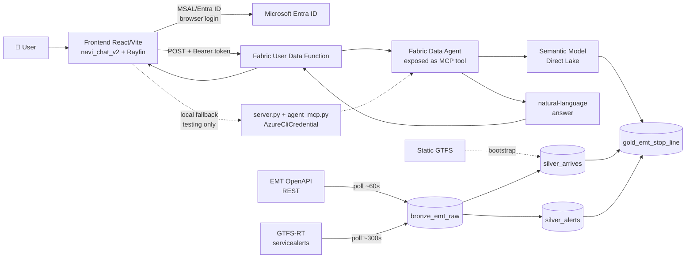

# NAVI — From live data to a natural-language answer

**Final project · Factoría F5 × Microsoft (2026)**
> A conversational agent that answers natural-language questions about near real-time urban mobility data, built on Microsoft Fabric.

[]()
[]()
[]()

---

## 📌 Context

It's 6 pm in Madrid. Someone is waiting for the bus and wonders: *how long until it arrives?* The data exists and is public, but turning it into a readable answer requires an invisible chain of work — capture, modeling, querying, interface. Days of work for a three-second question.

**NAVI** closes that gap: a conversational agent that answers natural-language questions about **EMT Madrid** data in near real-time, without a single line of SQL, built entirely on **Microsoft Fabric**.

It is both the deliverable and the training material: each layer stitches together a different discipline (Data Engineering, Data Science, Agentic AI) into a single reproducible thread.

---

## 🎯 Goal

Build a system able to answer questions such as:

- *"How long until the next bus arrives at Lavapiés?"*
- *"Which buses are arriving at this stop right now?"*
- *"Are there active service alerts on line 27?"*
- *"How often does line M1 run?"*

connecting a live data source → an agent that understands that data → a conversational interface with a real-time map.

---

## 🗂️ Dataset and scope

**Source: EMT Madrid Open Data (EMT Madrid Mobility Labs)** — REST API (real-time arrivals) + GTFS-RT `servicealerts` (service alerts) + static GTFS (stops/lines master data).

**Geographic scope (deliberately scoped-down training PoC):**
- **Center:** Puerta del Sol (`40.416729, -3.703339`)
- **Radius:** circular geofence of **600 meters**
- **Confirmed coverage:** **52 stops** in-scope, and every line that passes through at least one of them
- **Target user profile:** a tourist or someone in the area asking about nearby buses

This is not full Madrid coverage — it's a reproducible cut designed to validate the end-to-end pattern, not to scale the data domain.

---

## 🏗️ Architecture (final, as-built)



**Flow of a question in production:**

1. The user types in the frontend chat.
2. The frontend gets an Entra ID token (MSAL, browser login) and calls the **Fabric User Data Function (UDF)** directly.
3. The UDF invokes the **Fabric Data Agent** via MCP (streamable HTTP).
4. The Data Agent translates the question into a query against the **Semantic Model (Direct Lake)**, built on top of the Gold table — it does not read Gold directly.
5. The Data Agent writes the final natural-language answer (no re-processing needed on the frontend side).
6. The answer flows back through the UDF → frontend → chat + map.

**Key difference from the initial reference architecture:** the custom multi-agent orchestration layer (supervisor + domain specialist with an external LLM) was dropped. The Fabric Data Agent resolves natural language → query → answer in a single hop, exposed as a single MCP tool.

---

## 🧱 Tech stack (final)

The architecture follows the **medallion** pattern (Bronze 1 · Silver per domain · Gold 1) and uses **MCP (Model Context Protocol)** as its interoperability piece: the Data Agent is exposed as an MCP server, so every layer above it is swappable without touching the rest.

The Microsoft route was implemented end to end. The alternatives column is kept as a reference for anyone who wants to replicate the pattern outside this stack — it was not built or tested in this project.

| Layer | Microsoft stack (used in production) | Open / agnostic alternative *(reference only, not implemented)* |
|---|---|---|
| Ingestion | PySpark notebook on Fabric — `arrives` poll ~60s, GTFS-RT ~300s | Airflow/Dagster + cron, Kafka/Redpanda |
| Lakehouse | Fabric Lakehouse (Delta) — `bronze_emt_raw` → `silver_arrives` + `silver_alerts` → `gold_emt_stop_line` | Delta Lake/Iceberg on MinIO/S3, DuckDB |
| Semantic layer | Semantic Model Direct Lake on top of Gold — the layer the Data Agent queries | Cube, dbt Semantic Layer |
| Data agent | Fabric Data Agent (GA), exposed as an MCP tool | Vanna.ai, Wren AI, LangChain SQL Agent, LlamaIndex |
| Tool protocol | MCP — open standard | MCP (same protocol; it's agnostic by design) |
| Frontend↔data connection | Fabric User Data Function, called directly from the browser | Own API Gateway / Cloud Function + generic OAuth |
| Auth | Microsoft Entra ID via MSAL (`@azure/msal-browser`, `@azure/msal-node`) | Any OIDC/OAuth2 provider |
| Frontend | React 19 + Vite + TypeScript, Rayfin (auth + Fabric static hosting), MapLibre GL + deck.gl (3D map) | Any SPA + own hosting, Streamlit/Chainlit for a simpler MVP |
| LLM model | Azure OpenAI (most recent available model) — the Fabric Data Agent uses the same provider as the Phase 3 custom agent, now via Azure instead of calling the OpenAI API directly | Direct OpenAI (as in Phase 3, on mock data) |
| Local fallback / testing | FastAPI (`server.py`) + `agent_mcp.py` with `AzureCliCredential` | — |

> Full installation and run guide: [`docs/technical-guide.md`](docs/technical-guide.md)

---

## 🔀 Closing decisions (Option A/B and alternatives)

1. **Agent orchestration — Fabric Data Agent vs. a custom agent (Phase 3, on OpenAI)**
   Phase 3 started with a custom domain-specialist agent on OpenAI (`agents/emt_specialist/agent.py`, over mock data). It was dropped in favor of the **Fabric Data Agent** as the single MCP tool, per the stakeholder's mandate not to leave the Microsoft/Azure/Fabric stack. The Phase 3 code is kept in the repo as a historical learning reference, not as part of the production system.

2. **Frontend↔data connection — local proxy backend vs. direct Fabric UDF**
   - *Option A (dropped for production):* a local FastAPI backend (`server.py`) acting as a proxy to the Data Agent using `AzureCliCredential`.
   - *Option B (chosen, production):* the frontend calls the **Fabric User Data Function** directly, authenticated with Entra ID/MSAL from the browser, with no intermediate backend.
   The local backend **stays in the repo as a local testing/development fallback**, not as part of the production flow.

3. **Single Silver table vs. Silver split by domain**
   - *Option A (initial reference):* a single `silver_emt`.
   - *Option B (chosen, ADR-037):* split into `silver_arrives` (poll history, no alerts) + `silver_alerts` (latest-only alert snapshot). Gold keeps the same `alert_*` column contract.

4. **Coordinates for the 3D map — extending Gold vs. mocking**
   - *Option A (decided, in progress):* extend `gold_emt_stop_line` with `bus_lat_1/lon_1`, `bus_lat_2/lon_2` and inherited `stop_lat/lon`, to render real stops and buses with no mocks.
   - *Option B (used in the meantime):* mock stop coordinates on the frontend (`src/utils/geoData.ts`) to draw an approximate line.
   **Status:** decision **closed** — Option A is being implemented. The mock remains a temporary solution until the Gold extension is available.

5. **Feedback 👍/👎:** buttons present in the UI. **Decision closed:** it will be persisted in a table in the app's workspace Lakehouse (still to be implemented).

---

## 📚 Key concepts

- **Medallion architecture**: a three-layer data modeling pattern — *bronze* (raw), *silver* (cleaned/conformed, per domain), *gold* (business-ready aggregates).
- **MCP (Model Context Protocol)**: an open standard that exposes tools/data to agents in a uniform way, independent of the model provider.
- **Fabric Data Agent**: a managed agent that translates natural language into queries against the Semantic Model, and writes the final answer.
- **Fabric User Data Function (UDF)**: a Fabric serverless function callable with Entra ID auth, the bridge between the frontend and the Data Agent in production.

---

## ▶️ How to use the application

**🌐 Try the app in production:** https://hale-hawk-199fba3f05-francecentral.webapp.fabricapps.net/

**🎥 Demo:**
> _[placeholder — add demo gif/video here]_

**💻 Want to run it locally?** Full installation steps, environment variables, and the no-UDF fallback are in [`docs/technical-guide.en.md`](docs/technical-guide.en.md).

---

## 📁 Repo structure (`main` branch)

```
.
├── agents/
│   └── emt_specialist/       # Phase 3 agent on OpenAI (mock) — historical, not production
├── docs/
│   ├── data-source-contract-v4.md   # current data contract (v4.3)
│   ├── technical-guide.md           # installation and run guide
│   └── adr/                         # architecture decision records (ADR-001..037)
├── frontend/
│   ├── navi_chat_v2/          # ✅ current app: React + Vite + Rayfin + MSAL
│   │   ├── src/services/      # agentService.ts (UDF), udfAuth.ts (MSAL)
│   │   ├── server.py          # local fallback (FastAPI)
│   │   └── agent_mcp.py       # local fallback (MCP client with AzureCliCredential)
│   └── navi-chat/             # previous frontend version — historical
├── notebooks/                 # bronze→silver→gold ingestion and transformation (Fabric)
├── scripts/                   # test utilities against the EMT API
├── tests/
└── README.md
```

---

## 👥 Team roles

| Role | Person | Responsibilities |
|---|---|---|
| Product Owner / AI Developer / Backend | Jonathan Brasales | Backlog, stakeholder validation, agent development (Fabric Data Agent + MCP), and backend (UDF, local fallback) |
| Scrum Master / Frontend Developer | Iris Fernanda Amorim | Facilitates ceremonies, manages the backlog and access/credentials, and frontend development |
| Data Engineer | Mirae Kang | Ingestion → medallion modeling (bronze/silver/gold) |
| Analytics Developer | Raúl Machaca | Semantic layer (Semantic Model Direct Lake) + app performance dashboard |

---

## 🔗 References

- Microsoft Agent Framework: https://learn.microsoft.com/agent-framework/overview/
- Fabric Data Agent (GA): https://learn.microsoft.com/fabric/data-science/concept-data-agent
- Fabric User Data Functions: https://learn.microsoft.com/fabric/data-engineering/user-data-functions/
- Model Context Protocol (MCP): https://modelcontextprotocol.io
- Direct Lake (Fabric): https://learn.microsoft.com/fabric/fundamentals/direct-lake-overview
- Current data contract: [`docs/data-source-contract-v4.md`](docs/data-source-contract-v4.md)

