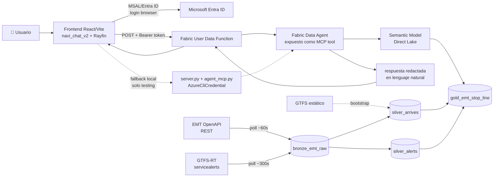

# NAVI — De dato vivo a respuesta en lenguaje natural

**Proyecto final · Factoría F5 × Microsoft (2026)**
> Un agente conversacional que responde en lenguaje natural sobre datos de movilidad urbana en tiempo casi-real, construido sobre Microsoft Fabric.

[]()
[]()
[]()

---

## 📌 Contexto

Son las 18:00 en Madrid. Alguien espera el bus y se pregunta: *¿cuánto tarda en llegar?* El dato existe y es público, pero convertirlo en una respuesta legible exige una cadena invisible de trabajo — captura, modelado, consulta, interfaz. Días de trabajo para una pregunta de tres segundos.

**NAVI** cierra esa distancia: un agente conversacional que responde en lenguaje natural sobre datos de **EMT Madrid** en tiempo casi-real, sin una sola línea de SQL, construido íntegramente sobre **Microsoft Fabric**.

Es, a la vez, el entregable y el material formativo: cada capa cose una disciplina distinta (Data Engineering, Data Science, IA Agéntica) en un único hilo reproducible.

---

## 🎯 Objetivo

Construir un sistema capaz de responder preguntas como:

- *"¿Cuánto tarda el próximo bus en la parada de Lavapiés?"*
- *"¿Qué autobuses llegan ahora a esta parada?"*
- *"¿Hay incidencias activas en la línea 27?"*
- *"¿Cada cuánto pasa la línea M1?"*

conectando una fuente de datos en vivo → un agente que entiende esos datos → una interfaz conversacional con mapa en tiempo real.

---

## 🗂️ Dataset y ámbito

**Fuente: EMT Madrid Open Data (EMT Madrid Mobility Labs)** — API REST (llegadas en tiempo real) + GTFS-RT `servicealerts` (incidencias) + GTFS estático (maestro de paradas/líneas).

**Alcance geográfico (PoC formativo, deliberadamente acotado):**
- **Centro:** Puerta del Sol (`40.416729, -3.703339`)
- **Radio:** geofence circular de **600 metros**
- **Cobertura confirmada:** **52 paradas** in-scope, todas las líneas que pasan por al menos una de ellas
- **Perfil de usuario objetivo:** turista o persona en la zona preguntando por buses cercanos

No es cobertura de Madrid completa — es un recorte reproducible pensado para validar el patrón end-to-end, no para escalar el dominio del dato.

---

## 🏗️ Arquitectura (final, real)



**Flujo de una pregunta en producción:**

1. El usuario escribe en el chat del frontend.
2. El frontend obtiene un token de Entra ID (MSAL, login en navegador) y llama directo al **Fabric User Data Function (UDF)**.
3. El UDF invoca al **Fabric Data Agent** vía MCP (streamable HTTP).
4. El Data Agent traduce la pregunta a consulta sobre el **Semantic Model (Direct Lake)**, montado sobre la tabla Gold — no lee Gold directamente.
5. El Data Agent redacta la respuesta final en lenguaje natural (no hace falta reprocesarla del lado del frontend).
6. La respuesta vuelve al UDF → frontend → chat + mapa.

**Diferencia clave respecto a la arquitectura de referencia inicial:** se descartó la capa de orquestación multi-agente propia (supervisor + agente especialista con LLM externo). El Fabric Data Agent resuelve lenguaje natural → consulta → redacción en un solo salto, expuesto como único tool MCP.

---

## 🧱 Stack tecnológico (final)

La arquitectura sigue el patrón **medallion** (Bronze 1 · Silver por dominio · Gold 1) y usa **MCP (Model Context Protocol)** como pieza de interoperabilidad: el Data Agent se expone como servidor MCP, por lo que cada capa por encima es intercambiable sin tocar el resto.

Se implementó la ruta Microsoft de punta a punta. La columna de alternativas queda como referencia para quien quiera replicar el patrón fuera de este stack — no se construyó ni se probó en este proyecto.

| Capa | Stack Microsoft (usado en producción) | Alternativa abierta / agnóstica *(solo referencia, no implementada)* |
|---|---|---|
| Ingesta | Notebook PySpark en Fabric — poll `arrives` ~60s, GTFS-RT ~300s | Airflow/Dagster + cron, Kafka/Redpanda |
| Lakehouse | Fabric Lakehouse (Delta) — `bronze_emt_raw` → `silver_arrives` + `silver_alerts` → `gold_emt_stop_line` | Delta Lake/Iceberg sobre MinIO/S3, DuckDB |
| Capa semántica | Semantic Model Direct Lake sobre Gold — capa que consulta el Data Agent | Cube, dbt Semantic Layer |
| Agente de datos | Fabric Data Agent (GA), expuesto como MCP tool | Vanna.ai, Wren AI, LangChain SQL Agent, LlamaIndex |
| Protocolo de herramientas | MCP — estándar abierto | MCP (el mismo protocolo; es agnóstico por diseño) |
| Conexión frontend↔datos | Fabric User Data Function, invocada directo desde el navegador | API Gateway / Cloud Function propia + OAuth genérico |
| Auth | Microsoft Entra ID vía MSAL (`@azure/msal-browser`, `@azure/msal-node`) | Cualquier proveedor OIDC/OAuth2 |
| Frontend | React 19 + Vite + TypeScript, Rayfin (auth + static hosting Fabric), MapLibre GL + deck.gl (mapa 3D) | Cualquier SPA + hosting propio, Streamlit/Chainlit para un MVP más simple |
| Modelo LLM | Azure OpenAI (modelo más reciente disponible) — el Fabric Data Agent usa el mismo proveedor que el agente propio de Fase 3, ahora vía Azure en vez de directo a la API de OpenAI | OpenAI directo (como en Fase 3, sobre mock) |
| Fallback / testing local | FastAPI (`server.py`) + `agent_mcp.py` con `AzureCliCredential` | — |

> Guía de instalación y ejecución completa: [`docs/technical-guide.md`](docs/technical-guide.md)

---

## 🔀 Decisiones de cierre (Option A/B y alternativas)

1. **Orquestación del agente — Fabric Data Agent vs. agente propio (Fase 3, sobre OpenAI)**
   Fase 3 arrancó con un agente especialista propio sobre OpenAI (`agents/emt_specialist/agent.py`, sobre mock). Se descartó a favor del **Fabric Data Agent** como único tool MCP, por mandato del stakeholder de no salir del stack Microsoft/Azure/Fabric. El código de Fase 3 se conserva en el repo como referencia histórica de aprendizaje, no como parte del sistema en producción.

2. **Conexión frontend↔datos — backend proxy local vs. Fabric UDF directo**
   - *Opción A (descartada para producción):* backend FastAPI local (`server.py`) que hace de proxy hacia el Data Agent con `AzureCliCredential`.
   - *Opción B (elegida, producción):* el frontend llama directo al **Fabric User Data Function**, autenticado con Entra ID/MSAL desde el navegador, sin backend intermedio.
   El backend local **se mantiene en el repo como fallback de testing/desarrollo local**, no como parte del flujo de producción.

3. **Silver como tabla única vs. Silver por dominio**
   - *Opción A (referencia inicial):* una sola `silver_emt`.
   - *Opción B (elegida, ADR-037):* split en `silver_arrives` (historial de polls, sin alertas) + `silver_alerts` (snapshot latest-only de incidencias). Gold mantiene el mismo contrato de columnas `alert_*`.

4. **Coordenadas para el mapa 3D — extender Gold vs. mock**
   - *Opción A (decidida, en implementación):* extender `gold_emt_stop_line` con `bus_lat_1/lon_1`, `bus_lat_2/lon_2` y heredar `stop_lat/lon`, para pintar paradas y buses reales sin mocks.
   - *Opción B (usada mientras tanto):* mock de coordenadas de paradas en frontend (`src/utils/geoData.ts`) para trazar una línea aproximada.
   **Estado:** decisión **cerrada** — se implementa la Opción A. El mock queda como solución temporal hasta que la extensión de Gold esté disponible.

5. **Feedback 👍/👎:** botones presentes en la UI. Se persistirán en una tabla del Lakehouse en el workspace del backend.

---

## 📚 Conceptos clave

- **Medallion architecture**: patrón de modelado de datos en tres capas — *bronze* (raw), *silver* (limpio/conformado, por dominio), *gold* (agregados listos para negocio).
- **MCP (Model Context Protocol)**: estándar abierto que expone herramientas/datos a agentes de forma uniforme, independiente del proveedor de modelo.
- **Fabric Data Agent**: agente gestionado que traduce lenguaje natural a consultas sobre el Semantic Model, y redacta la respuesta final.
- **Fabric User Data Function (UDF)**: función serverless de Fabric invocable con auth Entra ID, puente entre el frontend y el Data Agent en producción.

---

## ▶️ Cómo usar la aplicación

**🌐 Prueba la app en producción:** https://hale-hawk-199fba3f05-francecentral.webapp.fabricapps.net/


**🎥 Demo:**
> _[placeholder — añadir gif/video de la demo aquí]_

**💻 ¿Quieres correrla en local?** Toda la instalación, variables de entorno y el fallback sin UDF están en [`docs/technical-guide.md`](docs/technical-guide.md).

---

## 📁 Estructura del repo (rama `main`)

```
.
├── agents/
│   └── emt_specialist/       # Agente Fase 3 sobre OpenAI (mock) — histórico, no producción
├── docs/
│   ├── data-source-contract-v4.md   # contrato de datos vigente (v4.3)
│   ├── technical-guide.md           # instalación y ejecución
│   └── adr/                         # decisiones de arquitectura (ADR-001..037)
├── frontend/
│   ├── navi_chat_v2/          # ✅ app vigente: React + Vite + Rayfin + MSAL
│   │   ├── src/services/      # agentService.ts (UDF), udfAuth.ts (MSAL)
│   │   ├── server.py          # fallback local (FastAPI)
│   │   └── agent_mcp.py       # fallback local (cliente MCP con AzureCliCredential)
│   └── navi-chat/             # versión anterior del frontend — histórica
├── notebooks/                 # ingesta y transformación bronze→silver→gold (Fabric)
├── scripts/                   # utilidades de prueba contra la API EMT
├── tests/
└── README.md
```

---

## 👥 Roles del equipo

| Rol | Persona | Responsabilidades |
|---|---|---|
| Product Owner / AI Developer / Backend | Jonathan Brasales | Backlog, validación con stakeholder, desarrollo del agente (Fabric Data Agent + MCP) y del backend (UDF, fallback local) |
| Scrum Master / Frontend Developer | Iris Fernanda Amorim | Facilita ceremonias, gestiona el backlog y accesos/credenciales, y desarrollo de frontend |
| Data Engineer | Mirae Kang | Ingesta → modelado medallion (bronze/silver/gold) |
| Analytics Developer | Raúl Machaca | Capa semántica (Semantic Model Direct Lake) + dashboard de rendimiento de la app |

---

## 🔗 Referencias

- Microsoft Agent Framework: https://learn.microsoft.com/agent-framework/overview/
- Fabric Data Agent (GA): https://learn.microsoft.com/fabric/data-science/concept-data-agent
- Fabric User Data Functions: https://learn.microsoft.com/fabric/data-engineering/user-data-functions/
- Model Context Protocol (MCP): https://modelcontextprotocol.io
- Direct Lake (Fabric): https://learn.microsoft.com/fabric/fundamentals/direct-lake-overview
- Contrato de datos vigente: [`docs/data-source-contract-v4.md`](docs/data-source-contract-v4.md)

