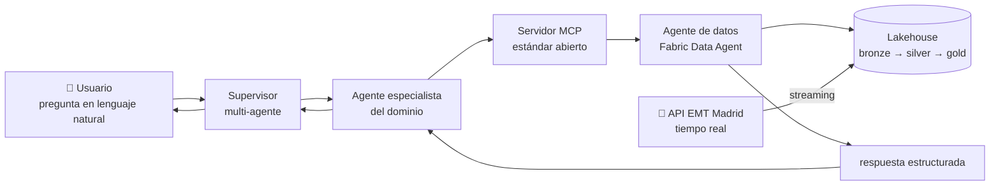

# 🚌 De dato vivo a respuesta en lenguaje natural

**Proyecto final · Factoría F5 × Microsoft (2026)**
> Un vertical agéntico end-to-end que colapsa una cadena de días de trabajo (captura → modelado → consulta → dashboard) en una conversación de segundos.

[]()
[]()
[]()

---

## 📌 Contexto

Son las 18:00. En el aula, alguien lanza una pregunta sencilla: *"¿cuánto tarda el próximo bus en llegar a mi parada, y qué líneas tienen más retraso ahora mismo?"*

El dato existe y es público. Pero responder esa pregunta hoy, en una organización real, exige una cadena de especialistas: alguien que capture los datos, alguien que los modele, alguien que escriba la consulta, alguien que monte el cuadro de mando. Días de trabajo para una pregunta de diez segundos.

Este proyecto cierra esa distancia construyendo un **agente de datos conversacional** capaz de responder preguntas en lenguaje natural sobre datos que están vivos, en tiempo casi-real — sin que nadie escriba una sola línea de SQL.

Es, a la vez, el entregable y el material formativo: cada capa cose una disciplina distinta (Data Engineering, Data Science, IA Agéntica) en un único hilo reproducible.

---

## 🎯 Objetivo

Construir un sistema capaz de responder preguntas como:

- *"¿Cuánto tarda el próximo bus en la parada de Lavapiés?"*
- *"¿Qué líneas tienen mayor retraso ahora mismo?"*
- *"Avísame si algún autobús de la línea 49 tiene más de 30 min de retraso."*
- *"Compárame las líneas de bus que pasen por Plaza Castilla."*

conectando una fuente de datos en vivo → un agente que entiende esos datos → un orquestador que decide cuándo preguntarle.

---

## 🗂️ Dataset

**Fuente elegida: EMT Madrid Open Data (EMT Madrid Mobility Labs)**

API pública de transporte urbano de Madrid: llegadas en tiempo real a paradas de bus, estado de la red, ocupación. Requiere un token gratuito de registro (paso de setup que también es aprendizaje real sobre gestión de credenciales en producción).

**Por qué esta y no OpenSky (tráfico aéreo):** el dominio de movilidad urbana conecta directamente con la misión de inclusión social de Factoría F5, y las preguntas que responde el agente tienen impacto directo y cotidiano para cualquier usuario del transporte público. La arquitectura no cambia respecto a la alternativa considerada — solo cambia la fuente de datos.

---

## 🏗️ Arquitectura



**Flujo de una pregunta:**

1. El usuario pregunta en lenguaje natural.
2. El supervisor delega al agente especialista del dominio.
3. El especialista invoca `ask_dataagent()` vía servidor MCP.
4. El agente de datos traduce lenguaje natural → SQL/KQL.
5. Se ejecuta la consulta sobre datos vivos.
6. Vuelve una respuesta estructurada.
7. El especialista añade contexto.
8. El supervisor entrega la respuesta final al usuario.

> Ejemplo real: *"¿Qué líneas tienen mayor retraso ahora mismo?"* → *"La línea 27 acumula el mayor retraso medio, 8 min sobre lo previsto"*

---

## 🧱 Stack tecnológico

La arquitectura sigue el patrón **medallion** (bronze → silver → gold) y se apoya en **MCP (Model Context Protocol)** como pieza clave: al exponerse el agente de datos como servidor MCP, cada capa por encima y por debajo es intercambiable.

| Capa | Función | Stack Microsoft (recomendado) | Alternativa abierta / agnóstica |
|---|---|---|---|
| Ingesta en tiempo real | Captura de eventos vía endpoint HTTP | Fabric Eventstream — HTTP Source | Kafka, Redpanda (+ cron/Python, Airflow, Dagster) |
| Almacén bronze (RT) | Persistencia rápida del raw | Fabric Eventhouse (KQL) | ClickHouse, Apache Druid, TimescaleDB |
| Lakehouse silver/gold | Modelado medallion | Fabric Lakehouse (Delta) | Delta Lake / Iceberg sobre MinIO/S3, DuckDB |
| Transformación | Limpieza + agregados | Notebook PySpark | dbt, Spark, Polars, DuckDB |
| Capa semántica | Métricas + relaciones | Semantic Model Direct Lake | Cube, dbt Semantic Layer |
| Agente de datos | Lenguaje natural → SQL/DAX/KQL | Fabric Data Agent (GA) | Vanna.ai, Wren AI, LangChain SQL Agent, LlamaIndex |
| Protocolo de herramientas | Exponer el agente como tool | MCP — estándar abierto | MCP (igual en ambos casos) |
| Orquestación multi-agente | Coordinar specialist + supervisor | Microsoft Agent Framework (patrón Magentic) | LangGraph, CrewAI, AutoGen, OpenAI Agents SDK, Pydantic AI |
| Modelo LLM | Razonamiento de los agentes | Azure OpenAI / Foundry | OpenAI, Anthropic, u open-source vía Ollama |
| Frontend demo | Chat UI end-to-end | — | Streamlit / Chainlit |

> ⚠️ Justificación pendiente de cerrar en el kickoff del lunes: se elige el stack según restricciones reales del equipo (skills, tiempo, licencias), no solo por el patrón "recomendado".

---

## 📚 Conceptos clave

- **Medallion architecture**: patrón de modelado de datos en tres capas — *bronze* (raw), *silver* (limpio/conformado), *gold* (agregados listos para negocio).
- **MCP (Model Context Protocol)**: estándar abierto que expone herramientas/datos a agentes de forma uniforme, independiente del proveedor de modelo.
- **MAF (Microsoft Agent Framework)**: sucesor de Semantic Kernel + AutoGen; framework de orquestación multi-agente (patrón *Magentic*: un supervisor delega en agentes especialistas).
- **Fabric Data Agent**: agente gestionado que traduce lenguaje natural a consultas sobre datos gobernados (SQL/DAX/KQL).

---

## 👥 Roles del equipo

Equipo de 4, trabajando en parejas fijas (con sync corto diario entre parejas para que nadie llegue al cierre sin entender la otra mitad del sistema):

| Rol | Persona | Responsabilidades |
|---|---|---|
| Product Owner | Jonathan Brasales | Elige dominio con el stakeholder, prioriza backlog, define y valida preguntas de prueba, QA continua del agente |
| Scrum Master | Iris Fernanda Amorim | Facilita ceremonias, gestiona el backlog, accesos/credenciales, testing del pipeline, documentación de reproducibilidad |
| Developer | Mirae Kang | Ingesta → modelado (Eventstream, medallion bronze/silver/gold, capa semántica) |
| AI Developer | Raúl Machaca | Agente básico sobre mock → MCP → supervisor → frontend |

**Parejas de trabajo:**
- **Developer + Scrum Master** → plataforma de datos (Fase 2)
- **AI Developer + Product Owner** → capa agéntica (Fase 3-5)
- **Cierre A** (Developer + AI Developer) → QA end-to-end
- **Cierre B** (PO + Scrum Master) → README, blog, diapositivas

> Roles cerrados en el kickoff del 06/07.

---

## 🔄 Metodología de trabajo

- **Framework**: Scrum, sprints de **1 semana** (3 sprints) + **1 semana de cierre** dedicada a QA y material publicable, para llegar con margen a la demo del **30/07**.
- **Tablero**: GitHub Projects, vinculado a las Issues del repo.
- **Issues**: una issue por tarea/historia de usuario, etiquetada por capa (`ingesta`, `lakehouse`, `agente`, `mcp`, `frontend`, `docs`) y por fase (`area:z1`, `area:z2`…).
- **Ramas**: `main` protegida · `feature/<nombre-issue>` para desarrollo · PR obligatorio con al menos 1 revisión.
- **Daily / seguimiento**: sync de 5-10 min por **Zoom**, entre las dos parejas (Developer+SM ↔ AI Developer+PO). Cada pareja le cuenta a la otra qué hizo y qué va a hacer — el objetivo no es solo destrabar bloqueos, sino que **las 4 personas entiendan el ciclo completo del producto** (dato → agente → frontend), no solo su mitad. 3 preguntas: qué se entregó, qué se entrega hoy, qué bloquea a la otra pareja. Demo interna de 10 min al cierre de cada sprint (viernes).
- **Definition of Done**: por issue — se define en los **criterios de aceptación** de cada issue, no como regla global.

**Calendario de sprints:**

| Sprint | Fechas | Foco |
|---|---|---|
| Sprint 1 | 6–10 jul | Z1 Setup + arranque Z2/Z3 en paralelo |
| Sprint 2 | 13–17 jul | Z2 (ingesta→gold) + Z3 (agente sobre mock→MCP) |
| Sprint 3 | 20–24 jul | Z4 (supervisor + frontend) + extensiones si sobra tiempo |
| Cierre | 27–30 jul | Cierre A (QA) + Cierre B (README/blog/slides) |
| **Demo** | **30/07** | 🎤 |

---

## 🗺️ Roadmap por fases

Modelo de trabajo: **Z1** todo el equipo junto · **Z2 y Z3 en paralelo por parejas** · **Z4** dividido en dos frentes de cierre.

| Fase | Qué se entrega | Quién | Depende de |
|---|---|---|---|
| 0. Setup (Z1) | Tenant + capacidad decidida (trial o F2), workspace | Todos (2 días máx) | — |
| 1. Fuente de datos | Dominio elegido → **EMT Madrid** ✅ | PO, con el stakeholder | Reunión inicial |
| 2. Ingesta → modelado (Z2) | Datos vivos consultables en tablas gold | Developer + Scrum Master | Fase 0 |
| 3. Agente básico (Z3, sobre mock) | Agente construido y probado sobre datos simulados | AI Developer + PO | Fase 1 (no espera a Fase 2) |
| 4-5. MCP + supervisor + frontend (Z3) | Chat end-to-end + mapa en vivo + feedback 👍/👎 | AI Developer + PO | Fase 3 + tabla gold real de Fase 2 |
| 6. Extensión | Segundo dominio, alertas, voz, ranking, anomalías | Según capa | Fase 5 estable |
| Cierre A — QA completo | Validación end-to-end, fixes | Developer + AI Developer | Fase 5 |
| Cierre B — README, blog, diapositivas | Material publicable y de portfolio | PO + Scrum Master | Fase 5 |

> ⚠️ Único punto de sincronización real: el AI Developer no puede validar con datos reales hasta que el Developer entregue la tabla gold — por eso Z3 arranca sobre mock desde el día 1, no espera a Z2.

**Setup (Z1) — checklist:**
- [ ] Crear/verificar tenant Microsoft 365.
- [ ] Intentar activar trial de 60 días en Fabric (o crear capacidad F2 de pago por uso si el tenant tiene menos de 90 días).
- [ ] Documentar la decisión (trial vs. F2) y coste estimado.
- [ ] Crear Workspace del proyecto y asignar capacidad; añadir a los 4 miembros.
- [ ] Si es F2, configurar pausa automática fuera de horario.
- [ ] Documentar el setup completo (reproducibilidad).

**Ideas de extensión (Fase 6, priorizadas por dependencia, no se activan hasta Fase 5 estable):**

| Idea | Capa | Prerrequisito |
|---|---|---|
| Alertas proactivas (ej. "avísame si la línea 49 tiene +30 min de retraso") | Z2 (regla) + Z3 (canal salida) | Stream estable en producción |
| Mapa en vivo interactivo | Frontend, sobre capa semántica (lat/lon) | Capa semántica lista |
| Modo voz (Azure AI Speech) | Z3/Z4 | Flujo texto→respuesta ya sólido |
| Ranking con gráfico (comparar líneas) | Z4, sobre capa semántica | Agente detecta intención de "comparar" |
| Detección de anomalías (picos de retraso) | Z2 (job sobre gold) + Z3 (mensaje chat) | Varios días de histórico acumulado |
| Feedback 👍/👎 | Tabla en Lakehouse + botones Streamlit | — |

---

## 📁 Estructura del repo *(propuesta inicial)*

```
.
├── data-ingestion/       # captura de eventos, conectores API
├── lakehouse/            # notebooks/scripts medallion (bronze/silver/gold)
├── semantic-layer/       # definición de métricas de negocio
├── data-agent/           # configuración del agente de datos + servidor MCP
├── agents/               # agente especialista y supervisor multi-agente
├── frontend/             # chat UI (Streamlit / Chainlit)
├── docs/                 # arquitectura detallada, decisiones, actas de reunión
└── README.md
```

---

## 🔗 Referencias

- Microsoft Agent Framework: https://learn.microsoft.com/agent-framework/overview/
- Fabric Data Agent (GA): https://learn.microsoft.com/fabric/data-science/concept-data-agent
- Fabric Eventstream — HTTP Source: https://learn.microsoft.com/fabric/real-time-intelligence/event-streams/add-source-http
- Model Context Protocol (MCP): https://modelcontextprotocol.io
- Direct Lake (Fabric): https://learn.microsoft.com/fabric/fundamentals/direct-lake-overview
- EMT Madrid Open Data (portal / registro de token): *(añadir enlace exacto tras el registro)*

---

*Documento vivo — se actualizará tras el kickoff del lunes con las decisiones de stack, Developer/AI Developer y calendario.*
