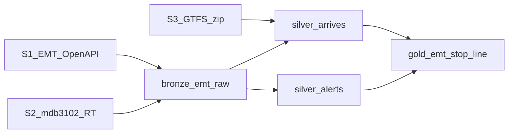
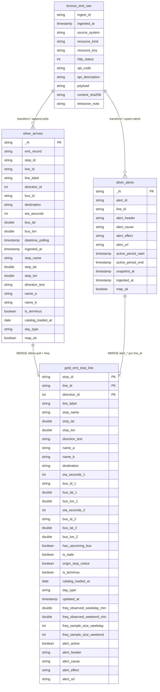

# Contrato de Origen de Datos: Proyecto EMT Madrid
**Versión:** 4.5
**Fecha:** 2026-07-29
**Estado:** Alineado con esquema medallion (Bronze 1 · Silver por dominio · Gold 1) — [ADR-015](adr/ADR-015-medallion-physical-schema-one-bronze-one-silver-one-gold-tab.md) enmendado, [ADR-037](adr/ADR-037-silver-split-into-silver-arrives-and-silver-alerts.md), coords [ADR-039](adr/ADR-039-gold-exposes-stop-and-live-bus-coordinates-for-map.md), catálogo EH [ADR-040](adr/ADR-040-eventhouse-catalogue-sot-seed-tag-and-kusto-udf-read.md). Serving + catálogo SoT: Eventhouse ([phase4-rti.md](./phase4-rti.md)).

---

## 0. Qué cambió respecto a la revisión anterior

### 4.4 → 4.5 (2026-07-29)

| # | Antes (4.4) | Ahora (4.5) |
|---|---|---|
| 1 | Catálogo (scope/denorm) SoT = Lakehouse seeds; UDF leía LH SQL | Catálogo SoT = Eventhouse `silver_arrives` con `emt_record=silver_arrives_seed`; UDF lee vía **Kusto REST** + SPN ([ADR-040](adr/ADR-040-eventhouse-catalogue-sot-seed-tag-and-kusto-udf-read.md)) |
| 2 | `emt_record` no figuraba en el contrato tabular | Valores: `bronze` · `silver_arrives` (poll) · **`silver_arrives_seed`** (catálogo) · `silver_alerts` · patches gold; Gold/freq **excluyen** seeds |
| 3 | Bootstrap diario → LH; overlap con arrives no tipificado en contrato | Bootstrap → `es_emt_arrives_silver` (append `catalog_loaded_at`); **no** pausar arrives; LH bootstrap = rollback hasta cutover |
| 4 | — | Secretos / SAS Eventstream en Variable Library; envío EH = `requests`+SAS (sin `azure.eventhub` obligatorio) |

### 4.3.1 → 4.4 (2026-07-28)

| # | Antes (4.3.1) | Ahora (4.4) |
|---|---|---|
| 1 | Gold sin coordenadas; mapa frontend dependía de mocks estáticos | Gold expone `stop_lat`/`stop_lon` (GTFS denorm desde Silver) y `bus_lat_1/2`·`bus_lon_1/2` (Arrive `geometry` → slots ETA 1/2) — [ADR-039](adr/ADR-039-gold-exposes-stop-and-live-bus-coordinates-for-map.md) (PO: Jonathan Brasales) |
| 2 | `silver_arrives` sin posición de vehículo | `silver_arrives` añade `bus_lat`/`bus_lon` por fila de poll con bus (GeoJSON Point `[lon,lat]`) |
| 3 | — | Grain / PK / ownership arrives·alerts **sin cambio**. Implementación primaria: Eventhouse (`rti/`); parity Lakehouse opcional |

### 4.3 → 4.3.1 (2026-07-23)

| # | Antes (4.3) | Ahora (4.3.1) |
|---|---|---|
| 1 | Freq: mediana de gaps entre `datetime_polling` únicos por `line_id`×ventana (ambiguo → gaps de poll) | Freq: observación = first-seen de visita de bus en stop×line×direction; gaps [1,60] min; mediana por `line_id`×ventana ([ADR-038](adr/ADR-038-observed-headway-passages-are-bus-visit-first-seen-at-stop.md)). **Sin cambio de columnas Gold** |

### 4.2 → 4.3 (2026-07-23)

| # | Antes (4.2) | Ahora (4.3) |
|---|---|---|
| 1 | Cap físico 1+1+1 (`silver_emt` único) | Silver por dominio: `silver_arrives` + `silver_alerts` ([ADR-037](adr/ADR-037-silver-split-into-silver-arrives-and-silver-alerts.md), [ADR-015](adr/ADR-015-medallion-physical-schema-one-bronze-one-silver-one-gold-tab.md)) |
| 2 | Alerts: Bronze → MERGE Gold `alert_*` (sin Silver) | Bronze → **`silver_alerts`** (latest-only) → MERGE Gold `alert_*` (columnas Gold **sin cambio**) |
| 3 | Nombre Silver polls = `silver_emt` | Rename → **`silver_arrives`** (mismo contrato poll-fact) |

### 4.1 → 4.2 (histórico)

| # | Antes (revisión 4.1) | Ahora (4.2) |
|---|---|---|
| 1 | Incidencias SoT = `arrives` Incident (`Text_IncidencesRequired_YN=Y`) | SoT = S2 GTFS-RT `servicealerts/proto`; arrives con `Incidences=N` ([ADR-011](adr/ADR-011-disruption-sot-is-gtfs-rt-servicealerts-not-arrive-incident.md), [ADR-010](adr/ADR-010-eta-sot-is-post-arrives-only.md)) |
| 2 | Gold = `gold_parada_linea`; ETA de 1 slot; `incident_*` | Gold = `gold_emt_stop_line`; ETA `eta_seconds_1/2` + `bus_id_1/2`; `alert_*` ([ADR-015](adr/ADR-015-medallion-physical-schema-one-bronze-one-silver-one-gold-tab.md), [ADR-022](adr/ADR-022-gold-eta-exposes-two-slots-under-one-table-constraint.md), [ADR-027](adr/ADR-027-alerts-denormalized-onto-gold-rows-at-line-grain-under-one-t.md)) |
| 3 | Freq = `freq_observed_minutes` + `freq_window_desc` | `freq_observed_weekday/weekend_min` + `freq_sample_size_*`; sin `freq_window_desc` ([ADR-023](adr/ADR-023-gold-frequency-windows-weekday-weekend-with-sample-sizes-no-.md)) |
| 4 | Silver con columnas `incident_*` | Silver polls **sin** alert; historial + `day_type` + `map_ok` ([ADR-016](adr/ADR-016-silver-is-append-only-poll-fact-wide-rows-not-polymorphic-re.md)) |
| 5 | Bronze solo arrives | Bronze = S1 REST + S2 RT (JSON); GTFS no entra en Bronze ([ADR-017](adr/ADR-017-bronze-holds-rest-and-rt-payloads-only-gtfs-bootstraps-silve.md), [ADR-018](adr/ADR-018-bronze-contract-uuid-ingest-id-and-no-enforced-column-types.md)) |
| 6 | Paso = GTFS bootstrap | Paso = S1 line stops SoT; path → `direction_id`; Arrive `destination` → dirección ([ADR-009](adr/ADR-009-served-stop-sot-is-s1-line-stops-path-not-gtfs-alone.md), [ADR-026](adr/ADR-026-map-arrive-destination-to-direction-id-require-path-mapping-.md)) |
| 7 | Semantic / KPI como parte del contrato de datos | Fuera del esquema físico de dominio ([ADR-031](adr/ADR-031-semantic-model-kpi-and-quality-logs-stay-outside-emt-domain-.md)) |

**Geofence, poll sin bus, frecuencia observada (sin GTFS planificado) y documento autocontenido** se mantienen.

---

## 1. Ámbito y geofence (cerrado)

([ADR-007](adr/ADR-007-geographic-scope-puerta-del-sol-geofence-600m-with-52-in-sco.md), [ADR-006](adr/ADR-006-product-scope-emt-city-bus-rest-plus-gtfs-rt-service-alerts-.md))

- **Centro:** Puerta del Sol — lat `40.416729`, lon `-3.703339`
- **Método:** radio circular (Haversine)
- **Radio:** **600 metros**
- **Regla `in_scope`:** parada `≤ 600m` → `true`. Una línea es `true` si pasa por al menos una parada in-scope.
- **Resultado confirmado:** **52** paradas in-scope
- **Perfil de usuario:** turista / persona en la zona preguntando por buses cercanos
- **Timezone:** `Europe/Madrid` ([ADR-008](adr/ADR-008-timezone-europe-madrid-for-calendar-day-type-and-alert-activ.md))

---

## 2. Historias de usuario cubiertas

| US | Pregunta tipo | Cubierta por |
|---|---|---|
| US-01 | ¿Cuánto tarda la línea X en llegar a la parada Y? | `gold_emt_stop_line` (`eta_seconds_1/2`, `has_upcoming_bus`); sin paso = sin fila |
| US-02 | ¿Qué autobuses llegan ahora a la parada Y? | `gold_emt_stop_line` (varias filas por `stop_id`; máx. 2 ETA por línea) |
| US-03 | ¿Qué líneas pasan por la parada Y (por nombre)? | Búsqueda nombre→`stop_id` en app/Agent (GTFS + refuerzo o Gold `stop_name`); sin cambio de esquema ([ADR-033](adr/ADR-033-us-03-name-resolution-may-stay-outside-gold-no-schema-change.md)) |
| US-04 (control) | Fuera de alcance / dato insuficiente → "no lo sé" | Incluye freq NULL; nunca inventar |
| US-07 | ¿Hay incidencias activas en la línea X? | `gold_emt_stop_line` (`alert_*`, replicado por `line_id`) |
| US-08 | ¿Cada cuánto pasa la línea X? | `gold_emt_stop_line` (`freq_observed_*`, `freq_sample_size_*`, `day_type`) |

US-05 (chat) y US-06 quedan fuera del dominio Fabric de este contrato.

---

## 3. Fuera de alcance

([ADR-006](adr/ADR-006-product-scope-emt-city-bus-rest-plus-gtfs-rt-service-alerts-.md), [ADR-036](adr/ADR-036-no-peak-or-off-peak-labels-no-daily-total-vehicle-counts-in-.md))

- Usar Incident de `arrives` como SoT de incidencias
- Cuerpo JSON del MDB Catalog API; GTFS frequencies / EMT Frequency* como SoT de frecuencia
- `deviation` / `positionTypeBus` / `isHead`
- Retraso vs horario teórico (sin enlace `bus_id`↔`trip_id`; sin TripUpdates)
- Ocupación, tarifas, billetes; Metro / Cercanías / otros consorcios
- Paradas/líneas fuera del geofence
- Etiquetas de pico, flota diaria total, log de calidad US-06, KPI, detalle Semantic (fuera del esquema físico)
- Columnas alert en **`silver_arrives`** (van en `silver_alerts`); doble almacenamiento Bronze raw `.pb`; columna `in_scope` en Gold; `direction_path` / `direction_code`; `freq_window_desc`
- Tabla Gold separada solo de alerts (las columnas `alert_*` en `gold_emt_stop_line` se mantienen)

---

## 4. Arquitectura — roles medallion (Bronze 1 · Silver por dominio · Gold 1)

([ADR-015](adr/ADR-015-medallion-physical-schema-one-bronze-one-silver-one-gold-tab.md), [ADR-037](adr/ADR-037-silver-split-into-silver-arrives-and-silver-alerts.md), [ADR-005](adr/ADR-005-source-taxonomy-s1-rest-only-s2-rt-servicealerts-s3-gtfs.md), [ADR-029](adr/ADR-029-polling-cadences-arrives-60s-try-and-adjust-rt-300s.md))

| Código | Significado |
|--------|-------------|
| **S1** | EMT OpenAPI (**solo REST**) |
| **S2** | mdb-3102 GTFS-RT **`servicealerts/proto`** (+ meta del catalog). Aunque el host sea EMT → **S2** |
| **S3** | GTFS static |

| Concepto | Primary | Fallback | No usado |
|----------|---------|----------|----------|
| Maestro de paradas | **S3** GTFS `stops` | Nombre/dirección S1 | S2 Catalog JSON |
| Coords de parada (mapa) | **S3** GTFS → denorm Silver → Gold `stop_lat`/`stop_lon` | StopInfo.geometry (no SoT) | Inventar / mock como SoT |
| ID de línea | S1 `line` = S3 `route_id` | — | S2 Catalog JSON |
| ETA | **S1** `arrives` | Ninguno | S3, S2 |
| Coords de bus en vivo | **S1** Arrive `geometry` → Silver `bus_lat`/`bus_lon` → Gold slots `_1`/`_2` | Ninguno | GTFS, TripUpdates |
| Paso · seed | **S1** line stops | Atributos GTFS (nombre·coords) | S2 |
| Incidencias | **S2** proto → `silver_alerts` | Ninguno | S1 Incident, S2 Catalog JSON |
| Frecuencia | **Observación** `silver_arrives` | Ninguno | GTFS freq, EMT Frequency* |
| day type | **S1** calendar | GTFS calendar | — |



GTFS (S3) bootstrap → `silver_arrives` directamente (no entra en Bronze) — en cutover Phase 5: Eventhouse seeds `silver_arrives_seed` ([ADR-040](adr/ADR-040-eventhouse-catalogue-sot-seed-tag-and-kusto-udf-read.md), [ADR-017](adr/ADR-017-bronze-holds-rest-and-rt-payloads-only-gtfs-bootstraps-silve.md)). Semantic / Data Agent leen Gold ([ADR-031](adr/ADR-031-semantic-model-kpi-and-quality-logs-stay-outside-emt-domain-.md)).

**Frecuencia de actualización**

| Fuente | Frecuencia | Notas |
|--------|------------|-------|
| GTFS + seed S1 line stops | 1×/día | Paso alineado con S1 |
| S1 calendar | 1×/día | Material para `day_type` |
| S1 `arrives` | Ideal **60s** | Mantener·intentar. `is_stale` = 180s fijo |
| S2 `servicealerts` | **300s** | → `silver_alerts` latest-only |

- **Bronze:** carga bruta S1/S2; sin forzar tipos ni NOT NULL.
- **Silver arrives:** historial append-only de polls; fuente de freq y ETA latest.
- **Silver alerts:** snapshot tipado latest-only; única entrada de `alert_*` a Gold.
- **Gold:** una fila por `(stop_id, line_id, direction_id)` in-scope con paso S1; estado reciente + agregados + `alert_*`.

### Pipeline

1. **1×/día:** atributos GTFS + S1 line stops → seed `silver_arrives` con **`emt_record=silver_arrives_seed`** · `catalog_loaded_at` (SoT cutover: Eventhouse vía `es_emt_arrives_silver`; LH = rollback) ([ADR-040](adr/ADR-040-eventhouse-catalogue-sot-seed-tag-and-kusto-udf-read.md))
2. **1×/día:** S1 calendar → Bronze → Silver/Gold `day_type` (LH path / audit; day_type también en seed/poll)
3. **~60s:** S1 `arrives` → Bronze → append `silver_arrives` (`emt_record=silver_arrives`, `_rk`, resolve label, `destination`→`direction_id`) → Gold (ETA·stale·freq). **No** toca `alert_*`. Catálogo leído de seeds EH (`max(catalog_loaded_at)`).
4. **~300s:** S2 `.pb` → JSON → Bronze → upsert `silver_alerts` → MERGE Gold `alert_*` por `line_id` (`alert_active` con `now`)
5. **Concurrencia:** arrives 24/7 **no se pausa** durante bootstrap; Gold/freq excluyen `silver_arrives_seed` antes de `max(datetime_polling)`.

---

## 5. Diagrama del esquema físico completo

Mismos **nombres y grains** en Lakehouse (`lh_emt_madrid`, rollback) y Eventhouse (`eh_emt_madrid` / `db_emt`, SoT hot path + catálogo tras Phase 5). Relaciones lógicas de pipeline (no FK físicas obligatorias). Detalle: §6–§8.



| Tabla | Grain | Rol |
|-------|-------|-----|
| `bronze_emt_raw` | `(ingest_id, resource_kind, resource_key)` | Crudo S1+S2 |
| `silver_arrives` | 1 poll `(stop_id, line_id, direction_id)` · PK `_rk` | Historial polls; sin alert |
| `silver_alerts` | `alert_id` × `line_id` · PK `_rk` | Snapshot alerts; latest-only |
| `gold_emt_stop_line` | PK `(stop_id, line_id, direction_id)` | Serving agente |

---

## 6. Capa Bronze: `bronze_emt_raw`

([ADR-017](adr/ADR-017-bronze-holds-rest-and-rt-payloads-only-gtfs-bootstraps-silve.md), [ADR-018](adr/ADR-018-bronze-contract-uuid-ingest-id-and-no-enforced-column-types.md))

**Propósito:** carga en bruto de S1 REST y S2 RT. **GTFS no entra en Bronze.**

**Grain:** una recolección = `(ingest_id, resource_kind, resource_key)`.  
Ej.: `arrives:86`, `servicealerts:proto`, `calendar:20260720`, `line_stops:027:1`.

**Body de request `arrives`** ([ADR-010](adr/ADR-010-eta-sot-is-post-arrives-only.md)):

```json
{
  "cultureInfo": "es",
  "Text_StopRequired_YN": "Y",
  "Text_EstimationsRequired_YN": "Y",
  "Text_IncidencesRequired_YN": "N"
}
```

Sin `Text_LineInfoRequired_YN` (no está en el esquema oficial). Con Incidences=`N` no hacen falta campos DateTime de incidencias.

| column | Descripción |
|--------|-------------|
| `ingest_id` | UUID |
| `ingested_at` | Momento de ingestión |
| `source_system` | `EMT_OPENAPI` \| `MDB_GTFS_RT` |
| `resource_kind` | `arrives` \| `servicealerts` \| `calendar` \| `line_stops` … |
| `resource_key` | stopId / proto / fecha, etc. |
| `http_status` | Estado HTTP |
| `api_code` / `api_description` | Envelope S1 (si aplica) |
| `payload` | S1: JSON. S2: `.pb` → guardar **después de decodificar a JSON** |
| `content_sha256` | Hash del payload |
| `timezone_note` | `Europe/Madrid` |

**Deduplicación:** append-only. Se permite re-ingestar el mismo hash.

---

## 7. Capa Silver

### 7.1 `silver_arrives` (ex `silver_emt`)

([ADR-016](adr/ADR-016-silver-is-append-only-poll-fact-wide-rows-not-polymorphic-re.md), [ADR-037](adr/ADR-037-silver-split-into-silver-arrives-and-silver-alerts.md), [ADR-040](adr/ADR-040-eventhouse-catalogue-sot-seed-tag-and-kusto-udf-read.md), [ADR-019](adr/ADR-019-direction-grain-key-is-direction-id-only.md), [ADR-020](adr/ADR-020-stop-id-stored-as-string-for-stability-and-portability.md), [ADR-021](adr/ADR-021-line-id-vs-line-label-and-failed-arrive-label-resolution-exc.md))

**Propósito:** fact de historial de polls **y** filas de catálogo (seed) en la misma tabla física. Material de frecuencia observada = solo polls. Fuera del alcance del Data Agent. **Sin** columnas alert.

**Grain / PK:** poll = 1 fila `(stop_id, line_id, direction_id)` in-scope (con o sin bus). Seed catálogo = 1 fila por el mismo grain con bus/eta/destination NULL y `emt_record=silver_arrives_seed`.

```text
_rk = SHA256(
  stop_id | line_id | coalesce(direction_id,'') | coalesce(bus_id,'') | datetime_polling
)
```

| column | data type | Origen / derivado | Regla NULL |
|--------|-----------|-------------------|------------|
| `_rk` | string | PK | NOT NULL |
| `emt_record` | string | Discriminador de ruta | `silver_arrives` (poll) · `silver_arrives_seed` (catálogo); ver [ADR-040](adr/ADR-040-eventhouse-catalogue-sot-seed-tag-and-kusto-udf-read.md) |
| `stop_id` | string | S3/S1 | NOT NULL |
| `line_id` | string | ID interno resuelto | NOT NULL |
| `line_label` | string | Arrive `line` / maestro | NOT NULL |
| `direction_id` | int | GTFS `0`\|`1` | grain; empty → bootstrap fail-fast |
| `bus_id` | string | Arrive `bus` | NULL = sin bus |
| `destination` | string | Arrive | NULL si no hay bus |
| `eta_seconds` | int | Arrive `estimateArrive` | NULL si no hay bus |
| `bus_lat` / `bus_lon` | double | Arrive `geometry` GeoJSON Point · `coordinates` = **`[lon, lat]`** | NULL si sin bus / geometry ausente o inválida |
| `datetime_polling` | timestamp | Momento del poll | NOT NULL |
| `ingested_at` | timestamp | Bronze | NOT NULL |
| `stop_name` / `stop_lat` / `stop_lon` | — | GTFS denorm | |
| `direction_text` | string | GTFS | NULL permitido |
| `name_a` / `name_b` | string | Catálogo | NULL permitido |
| `is_terminus` | boolean | Catálogo | |
| `catalog_loaded_at` | date | Día del snapshot | |
| `day_type` | string | S1 calendar `LA`\|`SA`\|`FE` | Día del poll |
| `map_ok` | boolean | Resolve label→line_id | false → excluido de Gold |

| `direction_id` | Significado |
|----------------|-------------|
| `0` | GTFS 0 ↔ path EMT `…/stops/1/` (medido en 027·014) ([ADR-004](adr/ADR-004-close-emt-path-a-b-vs-gtfs-direction-id-mapping-for-lines-02.md)) |
| `1` | Sentido contrario |

| `day_type` | Significado |
|------------|-------------|
| `LA` | Laborable |
| `SA` | Sábado |
| `FE` | Festivo/domingo |

#### Reglas de `silver_arrives`

1. **Seed (catálogo):** insertar `(stop_id, line_id, direction_id)` in-scope con **`emt_record=silver_arrives_seed`**, `bus_id`/`eta_seconds`/`destination` NULL, `catalog_loaded_at` = día del run. Conjunto de paso = **S1 line stops SoT**. path `1` → `direction_id=0`, path `2` → `direction_id=1` (**obligatorio**). Denorm nombre·coords desde GTFS ([ADR-009](adr/ADR-009-served-stop-sot-is-s1-line-stops-path-not-gtfs-alone.md)). SoT cutover: Eventhouse vía `es_emt_arrives_silver`; **no** DELETE masivo de filas null-shaped en EH ([ADR-040](adr/ADR-040-eventhouse-catalogue-sot-seed-tag-and-kusto-udf-read.md)).
2. **Lectura de catálogo / scope:** solo seeds + `catalog_loaded_at == max(catalog_loaded_at)` (+ `map_ok`). Polls no sustituyen el catálogo.
3. **Sin paso:** no hay combinación → no hay fila Gold.
4. **Poll without bus:** fila con `emt_record=silver_arrives`, `bus_id` NULL (heartbeat; **no** es seed).
5. **Poll with bus:** 1 fila por vehículo (`bus_id` en `_rk`), `emt_record=silver_arrives`. En la práctica, máx. **2 buses** por mismo stop×label. Arrive no trae direction → **`destination` ≈ `name_b` → `direction_id=0`**, **`≈ name_a` → `1`**. Si falla el match, prohibido actualizar a ciegas ambas direcciones en Gold ([ADR-026](adr/ADR-026-map-arrive-destination-to-direction-id-require-path-mapping-.md)). Extraer `bus_lat`/`bus_lon` de `geometry`; no invertir lon/lat.
6. **Fallo de resolve de label:** `map_ok=false` — excluido del MERGE a Gold ([ADR-021](adr/ADR-021-line-id-vs-line-label-and-failed-arrive-label-resolution-exc.md)).
7. **Gold / freq:** excluir `emt_record == silver_arrives_seed` antes de latest poll / observaciones de headway.
8. **`deviation` / `positionTypeBus` / `isHead`:** siguen **unused** ([ADR-003](adr/ADR-003-arrive-field-policy-unused-no-apply-fields-and-undefined-dev.md)); solo se usa `geometry` para coords de bus.

**Deduplicación:** append-only, `_rk` idempotente (seeds y polls usan espacios de `_rk` distintos).

**Nota:** denormalización a propósito (nombre, coords, etc. por fila). Con ~52 paradas el volumen es chico; cero joins para servir Gold/agente pesa más que el almacenamiento en PoC.

### 7.2 `silver_alerts`

([ADR-037](adr/ADR-037-silver-split-into-silver-arrives-and-silver-alerts.md), [ADR-027](adr/ADR-027-alerts-denormalized-onto-gold-rows-at-line-grain-under-one-t.md), [ADR-011](adr/ADR-011-disruption-sot-is-gtfs-rt-servicealerts-not-arrive-incident.md), [ADR-008](adr/ADR-008-timezone-europe-madrid-for-calendar-day-type-and-alert-activ.md))

**Propósito:** fact tipado latest-only de S2 `servicealerts`. Única entrada para proyectar `alert_*` en Gold. Fuera del alcance del Data Agent.

**Grain / PK (A-1):** una fila = `alert_id` × `line_id`.

```text
_rk = SHA256(alert_id | line_id | snapshot_at)
```

| column | data type | Origen / derivado | Regla NULL |
|--------|-----------|-------------------|------------|
| `_rk` | string | PK | NOT NULL |
| `alert_id` | string | GTFS-RT `id` | NOT NULL |
| `line_id` | string | route/line resuelto | NULL si `map_ok=false` |
| `alert_header` / `alert_cause` / `alert_effect` / `alert_url` | string | S2 | NULL permitido |
| `active_period_start` / `active_period_end` | timestamp | S2 `active_period` | NULL si ausente |
| `snapshot_at` | timestamp | momento del snapshot | NOT NULL |
| `ingested_at` | timestamp | Bronze | NOT NULL |
| `map_ok` | boolean | resolve → `line_id` | false → excluido de Gold |

**Sin** columna `alert_active` en Silver: se calcula en el ensamblado de Gold con `now` (Europe/Madrid).

#### Reglas de `silver_alerts`

1. **latest-only:** upsert/reemplazo del snapshot actual; sin historial append en POC.
2. Un alert que afecta N líneas → **N filas** (`alert_id` × `line_id`).
3. **Prohibido** join por RT `stop_id` hacia grain de parada.
4. Fallo de mapeo de línea → fila con `map_ok=false` (o equivalente) en Silver/log; **no** inventar `line_id`; **no** MERGE a Gold.
5. Job de alerts: tras upsert Silver, **misma ejecución** MERGE `alert_*` en Gold. El job de arrives **no** modifica `alert_*`.

---

## 8. Capa Gold: `gold_emt_stop_line`

([ADR-015](adr/ADR-015-medallion-physical-schema-one-bronze-one-silver-one-gold-tab.md), [ADR-022](adr/ADR-022-gold-eta-exposes-two-slots-under-one-table-constraint.md), [ADR-027](adr/ADR-027-alerts-denormalized-onto-gold-rows-at-line-grain-under-one-t.md), [ADR-028](adr/ADR-028-freshness-is-stale-after-180-seconds-no-gold-in-scope-column.md), [ADR-037](adr/ADR-037-silver-split-into-silver-arrives-and-silver-alerts.md), [ADR-039](adr/ADR-039-gold-exposes-stop-and-live-bus-coordinates-for-map.md))

**Propósito:** serving US-01/02/03/07/08. Tabla de dominio que lee el Data Agent.

**PK = `(stop_id, line_id, direction_id)`**  
Una fila por combinación in-scope·paso S1 alineado, con o sin bus. Sin filas de dirección indeterminada.

| column | data type | Origen / derivado | Regla NULL |
|--------|-----------|-------------------|------------|
| `stop_id` | string | — | NOT NULL · **PK** |
| `line_id` | string | — | NOT NULL · **PK** |
| `direction_id` | int | `0`\|`1` | NOT NULL · **PK** |
| `line_label` | string | — | NOT NULL |
| `stop_name` | string | — | NOT NULL |
| `stop_lat` / `stop_lon` | double | Silver / GTFS denorm | NULL raro (catálogo sin coords) |
| `direction_text` | string | — | NULL permitido |
| `name_a` / `name_b` | string | — | NULL permitido |
| `destination` | string | Último poll (1.º bus) | NULL si no hay bus |
| `eta_seconds_1` | int | **ETA mínimo** del último poll del mismo grain | NULL si no hay |
| `bus_id_1` | string | Vehículo de `eta_seconds_1` | NULL si no hay |
| `bus_lat_1` / `bus_lon_1` | double | `geometry` del bus de `eta_seconds_1` | NULL si no hay bus / geometry inválida |
| `eta_seconds_2` | int | Segundo ETA más rápido | NULL si solo hay 1 |
| `bus_id_2` | string | Vehículo de `eta_seconds_2` | NULL si no hay |
| `bus_lat_2` / `bus_lon_2` | double | `geometry` del bus de `eta_seconds_2` | NULL si no hay 2.º bus / geometry inválida |
| `has_upcoming_bus` | boolean | `eta_seconds_1 IS NOT NULL` | NOT NULL |
| `is_stale` | boolean | `(now - updated_at) > 180s` | NOT NULL |
| `origin_stop_notice` | boolean | `is_terminus AND eta_seconds_1 IS NULL` | NOT NULL |
| `is_terminus` | boolean | — | NOT NULL |
| `catalog_loaded_at` | date | — | NOT NULL |
| `day_type` | string | Hoy S1 calendar `LA`\|`SA`\|`FE` | NOT NULL |
| `updated_at` | timestamp | Último poll | NOT NULL |
| `freq_observed_weekday_min` | double | Mediana (min) headway observado, ventana **LA** (misma fórmula ADR-038 que weekend) | NULL si sample &lt; 20 · replicado por línea |
| `freq_observed_weekend_min` | double | Mediana (min) headway observado, ventana **SA/FE** (misma fórmula ADR-038 que weekday) | NULL si sample &lt; 20 · replicado por línea |
| `freq_sample_size_weekday` | int | Nº observaciones válidas line·LA (definición §10 / ADR-038) | Replicado por línea |
| `freq_sample_size_weekend` | int | Nº observaciones válidas line·SA/FE (definición §10 / ADR-038) | Replicado por línea |
| `alert_active` | boolean | `silver_alerts` period vs **now** en ensamblado | NOT NULL |
| `alert_header` | string | `silver_alerts` | NULL si inactivo |
| `alert_cause` | string | `silver_alerts` | NULL si inactivo |
| `alert_effect` | string | `silver_alerts` | NULL si inactivo |
| `alert_url` | string | `silver_alerts` | NULL si inactivo |

**Contrato `alert_*`:** atributo a nivel `line_id` **replicado** en cada fila stop×direction. No es incidencia por parada. Prohibido join por RT `stop_id`. **Fuente única:** `silver_alerts` (no re-parsear Bronze en el job de Gold para alerts).

**Contrato `freq_*`:** grain de agregación Gold = **`line_id` + ventana**. No por stop×direction en la columna final. **Mismo valor replicado** en todas las filas Gold del mismo `line_id`. Fuente: historial `silver_arrives`. Fórmula (weekday y weekend idéntica salvo la ventana): observaciones de paso de bus en stop×line×direction → gaps [1,60] min → mediana por línea ([ADR-038](adr/ADR-038-observed-headway-passages-are-bus-visit-first-seen-at-stop.md)).

**Deduplicación:** MERGE on PK.

**Contrato mapa (coords):** `stop_lat`/`stop_lon` sirven la parada; `bus_lat_*`/`bus_lon_*` van **asociados** a `bus_id_1/2` del mismo slot ETA. Orden API: lon, lat. Hot path Eventhouse: ver [phase4-rti.md](./phase4-rti.md).

**Tratamiento de NULL**

- Sin bus → `eta_*` / `bus_id_*` / `bus_lat_*` / `bus_lon_*` NULL, `has_upcoming_bus=false`.
- Bus con ETA pero sin `geometry` usable → `bus_id_*`/`eta_*` OK; `bus_lat_*`/`bus_lon_*` NULL.
- `alert_active=false` → textos alert NULL.
- freq NULL → historial insuficiente.
- Sin paso → no hay fila.

**No va en Gold:** `in_scope`, `freq_window_desc`, picos, flota diaria, Incident, log de calidad, KPI, Semantic, `direction_path`/`direction_code`.

---

## 9. Modelo semántico y KPIs (fuera del esquema físico)

([ADR-031](adr/ADR-031-semantic-model-kpi-and-quality-logs-stay-outside-emt-domain-.md))

El esquema físico de dominio termina en `gold_emt_stop_line`. Semantic Model, medidas de negocio, logs de calidad y KPIs **no** forman parte de este contrato de columnas.

Orientación no vinculante para quien monte el Semantic sobre Gold:

| Nombre de negocio (ejemplo) | Columna en gold |
|---|---|
| Minutos estimados (1.er bus) | `eta_seconds_1 / 60` si `has_upcoming_bus` |
| Hay autobús | `has_upcoming_bus` |
| Dato obsoleto | `is_stale` |
| Aviso cabecera | `origin_stop_notice` |
| Alerta activa | `alert_active` |
| Descripción alerta | `alert_header` (solo si activa) |
| Frecuencia laborable / fin de semana | `freq_observed_weekday_min` / `freq_observed_weekend_min` (NULL → "no tengo ese dato todavía") |
| Parada en mapa | `stop_lat` / `stop_lon` |
| Buses en mapa (1.º / 2.º) | `bus_lat_1`/`bus_lon_1`, `bus_lat_2`/`bus_lon_2` |

**KPIs** — placeholder; no se inventan umbrales aquí. Candidatos con stakeholder: % respondidas sin "no lo sé", precisión vs app oficial, latencia, uptime del poll, cobertura in-scope fresca.

---

## 10. Reglas de negocio — US-08 (frecuencia observada)

([ADR-012](adr/ADR-012-frequency-sot-is-observed-silver-polls-with-no-planned-fallb.md), [ADR-024](adr/ADR-024-observed-frequency-aggregation-grain-is-line-id-plus-day-typ.md), [ADR-025](adr/ADR-025-observed-headway-formula-is-median-of-successive-gaps-in-min.md), [ADR-038](adr/ADR-038-observed-headway-passages-are-bus-visit-first-seen-at-stop.md), [ADR-030](adr/ADR-030-frequency-response-gate-20-observations-preferred-24h-warmup.md))

**Decisión cerrada:** frecuencia = agregación del historial real de `silver_arrives`. Nunca GTFS planificado ni Frequency* de EMT. Sin historial suficiente → US-04 ("no lo sé"), sin fallback silencioso.

- Fila silver candidata: `bus_id IS NOT NULL`, `map_ok=true`, `direction_id` presente. Mismo poll·mismo `bus_id` en el mismo stop×line×direction = 1 fila.
- **Observación (headway / sample_size):** primera vez que ese bus se ve en una **visita** en `stop_id`×`line_id`×`direction_id`×ventana. Nueva visita = primera vista, o misma bus desapareció **≥ 20 min** y vuelve ([ADR-038](adr/ADR-038-observed-headway-passages-are-bus-visit-first-seen-at-stop.md)). Mismo `bus_id` cada 2 min en la misma visita = **1** observación; `bus_id` distintos = observaciones distintas.
- Grain de agregación Gold: **`line_id` + ventana** (weekday=`LA`, weekend=`SA`\|`FE`). Gaps dentro de stop×line×direction; luego pool a la línea.
- Fórmula: observaciones ordenadas → intervalos en **[1, 60] min** → **mediana** por `line_id`×ventana → `freq_observed_*_min`.
- `freq_sample_size_*` = nº de **esas observaciones**. **&lt; 20** → ese `freq_observed_*` = NULL.
- Warm-up operativo recomendado **24h**. Gate de respuesta: prioridad a **20 muestras**.
- Agent: si no se indica día → elegir ventana con `day_type`; si se dice “laborable/fin de semana” → columna correspondiente.

**Formato de respuesta:** *"la M1 pasa cada 8 minutos entre semana"* / *"cada 12 minutos los fines de semana"*.

---

## 11. Incidencias (US-07) — S2 servicealerts

([ADR-011](adr/ADR-011-disruption-sot-is-gtfs-rt-servicealerts-not-arrive-incident.md), [ADR-027](adr/ADR-027-alerts-denormalized-onto-gold-rows-at-line-grain-under-one-t.md), [ADR-037](adr/ADR-037-silver-split-into-silver-arrives-and-silver-alerts.md), [ADR-008](adr/ADR-008-timezone-europe-madrid-for-calendar-day-type-and-alert-activ.md))

**Fuente de verdad:** S2 GTFS-RT `servicealerts/proto` (poll ~300s). **No** usar Incident embebido en `arrives`.

- Ingestión: `.pb` → JSON → `bronze_emt_raw` → **`silver_alerts`** (latest-only, grain `alert_id`×`line_id`) → MERGE Gold `alert_*` por `line_id`.
- `alert_active`: `true` si `now` (Europe/Madrid) cae en `active_period` **en el ensamblado de Gold** (no se persiste como hecho en Silver).
- Textos (`alert_header`, `alert_cause`, `alert_effect`, `alert_url`) NULL cuando inactivo.
- Semántica: atributo de **línea**, replicado en cada fila stop×direction del mismo `line_id`. No join por `stop_id` del RT.
- Fallo de mapeo a `line_id`: `map_ok=false` en Silver; excluido de Gold.

El body de `arrives` permanece con `Text_IncidencesRequired_YN=N` (ver §6); ETA no depende de incidencias.

---

## 12. Pendientes reales (ops / validación)

- [ ] Validar el umbral de 20 observaciones para `freq_observed_*` con los primeros días de datos reales ([ADR-030](adr/ADR-030-frequency-response-gate-20-observations-preferred-24h-warmup.md))
- [ ] Reportar intervalo real de arrives en producción (ideal 60s) ([ADR-029](adr/ADR-029-polling-cadences-arrives-60s-try-and-adjust-rt-300s.md))
- [ ] Definir KPIs con el stakeholder (fuera del esquema físico — [ADR-031](adr/ADR-031-semantic-model-kpi-and-quality-logs-stay-outside-emt-domain-.md))
- [ ] Almacenamiento Azure · región: **UNVERIFIED**
- [ ] Phase 5 Fabric cutover restante: pipeline `poll_*_scope_eh`, `pl_emt_bootstrap_daily` sin `%pip`, parar schedule LH bootstrap tras confianza ([phase4-rti.md](./phase4-rti.md) Steps E–G, [ADR-040](adr/ADR-040-eventhouse-catalogue-sot-seed-tag-and-kusto-udf-read.md))
